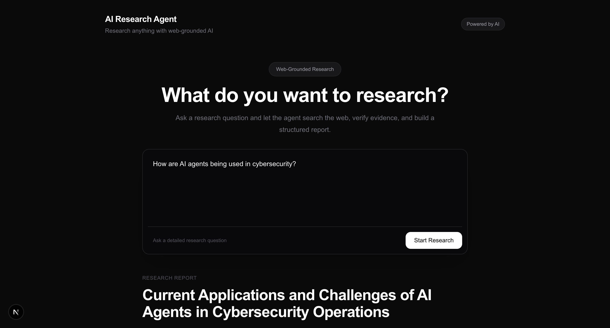
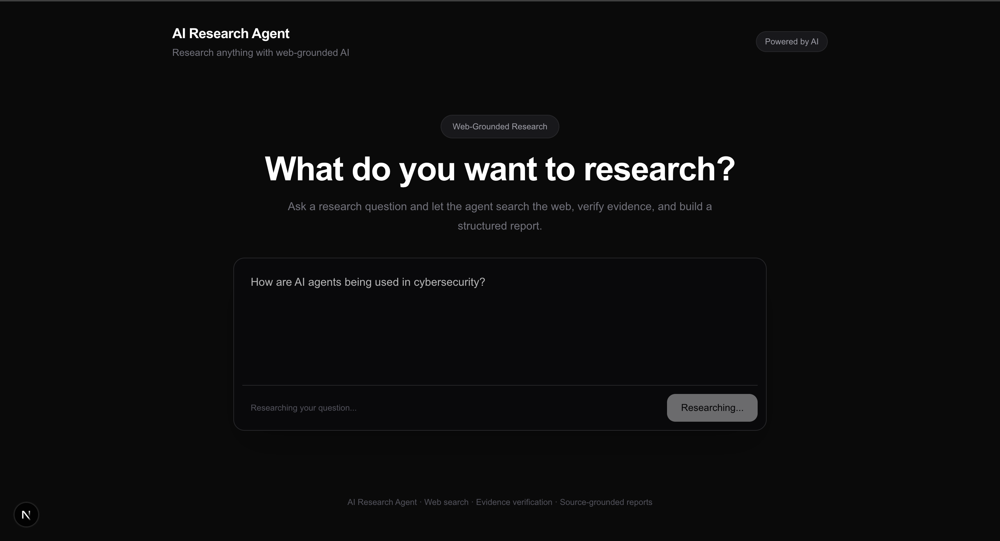
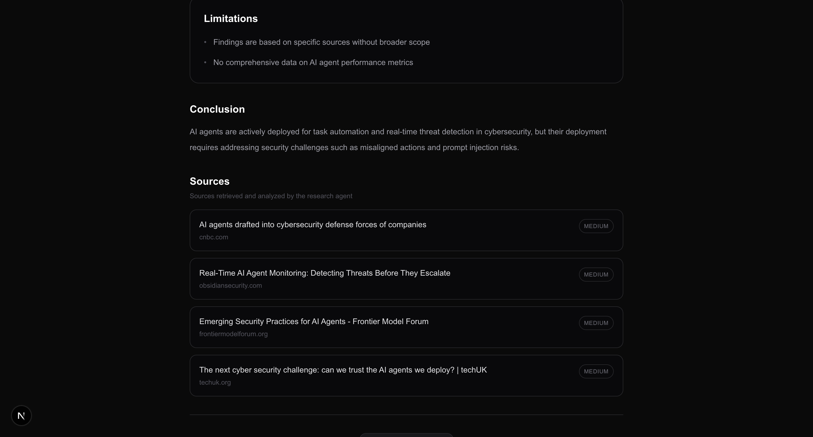

# AI Research Agent




> An AI-powered research agent that searches the web, analyzes evidence, verifies claims, and generates structured, source-grounded research reports.

AI Research Agent is a practical AI engineering project built to demonstrate how an LLM can be combined with external tools, web search, evidence verification, and multi-step orchestration to perform research tasks.

Unlike a traditional chatbot that directly generates an answer, this system follows a research workflow before producing its final response.

---

## Overview

A user provides a natural-language research question.

The agent then:

1. Plans the research
2. Breaks the question into focused sub-questions
3. Searches the web
4. Processes retrieved sources
5. Extracts claims and supporting evidence
6. Verifies claims against multiple sources
7. Checks whether the available evidence is sufficient
8. Performs a limited follow-up search when necessary
9. Generates a structured research report
10. Displays the report and sources in the UI

### High-Level Workflow

```text
                 User Research Question
                          │
                          ▼
                  Research Planner
                          │
                          ▼
                Focused Sub-Questions
                          │
                          ▼
                    Web Search
                          │
                          ▼
                  Source Processing
                          │
                          ▼
                 Evidence Extraction
                          │
                          ▼
                 Claim Verification
                          │
                          ▼
               Evidence Sufficiency
                    │           │
                 Enough       Not Enough
                    │           │
                    │           ▼
                    │     Follow-up Search
                    │           │
                    └───────┬───┘
                            ▼
                   Final Report Generator
                            │
                            ▼
                Structured Research Report
                            │
                            ▼
                     Sources + Findings
